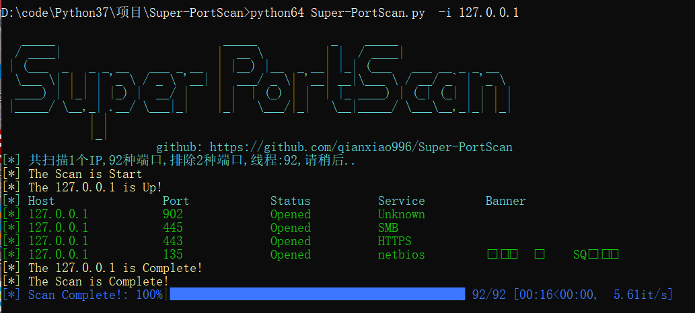

# Super-PortScan

一款Python编写的端口扫描器

```
   _____                         _____           _    _____
  / ____|                       |  __ \         | |  / ____|
 | (___  _   _ _ __   ___ _ __  | |__) |__  _ __| |_| (___   ___ __ _ _ __
  \___ \| | | | '_ \ / _ \ '__| |  ___/ _ \| '__| __|\___ \ / __/ _` | '_ \
  ____) | |_| | |_) |  __/ |    | |  | (_) | |  | |_ ____) | (_| (_| | | | |
 |_____/ \__,_| .__/ \___|_|    |_|   \___/|_|   \__|_____/ \___\__,_|_| |_|
             | |
             |_|
                       github: https://github.com/qianxiao996/Super-PortScan
Usage: Super-PortScan.py [OPTIONS]

Options:
  --version                Show the version and exit.
  -i, --ip TEXT            输入一个或一段ip，例如：192.168.1.1、192.168.1.1/24、192.168.1.1
                           -99
  -f, --file TEXT          从文件加载ip列表
  -p, --port TEXT          定义扫描的端口，例如:80、80,8080、80-8000
  -pf, --port_file TEXT    从文件加载端口列表，使用逗号分隔
  -rp, --remove_port TEXT  定义排除的端口，例如:25,110
  -jp, --jump_port         跳过主机发现
  -to, --timeout INTEGER   设置超时时间  [default: 1]
  -v, --verbose            显示详细信息
  -t, --threads INTEGER    定义扫描的线程  [default: 400]
  --txt TEXT               定义输出文本文件
  --html TEXT              定义输出html文件
  --help                   Show this message and exit.
```

使用示例

```
python3 Super-PortScan.py -i 127.0.0.1
python3 Super-PortScan.py -i 127.0.0.1-200 -p 80
python3 Super-PortScan.py -i 127.0.0.1/24 -p 80,8080
python3 Super-PortScan.py -i 127.0.0.1 -p 80-999
python3 Super-PortScan.py -i 127.0.0.1 -p 80,111,45-222

python3 Super-PortScan.py -f ip.txt
python3 Super-PortScan.py -i ip.txt -p 80
python3 Super-PortScan.py -f ip.txt -p 80,8080
python3 Super-PortScan.py -f ip.txt -p 80-999
python3 Super-PortScan.py -f ip.txt -p 80,111,45-222

python3 Super-PortScan.py -i 127.0.0.1 -v
python3 Super-PortScan.py -i 127.0.0.1 -t 100
```



html扫描报告


