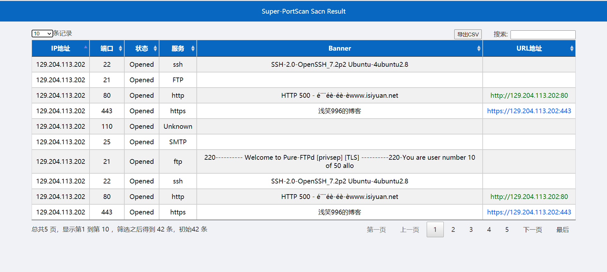

# Super-PortScan

一款Python编写的端口扫描器

```
   _____                         _____           _    _____
  / ____|                       |  __ \         | |  / ____|
 | (___  _   _ _ __   ___ _ __  | |__) |__  _ __| |_| (___   ___ __ _ _ __
  \___ \| | | | '_ \ / _ \ '__| |  ___/ _ \| '__| __|\___ \ / __/ _` | '_ \
  ____) | |_| | |_) |  __/ |    | |  | (_) | |  | |_ ____) | (_| (_| | | | |
 |_____/ \__,_| .__/ \___|_|    |_|   \___/|_|   \__|_____/ \___\__,_|_| |_|
             | |
             |_|
                       github: https://github.com/qianxiao996/Super-PortScan
usage:
        python3 Super-PortScan.py -i 192.168.1.1 -p 80
        python3 Super-PortScan.py -f ip.txt -p 80

optional arguments:
  -h, --help            show this help message and exit
  -i IP, --ip IP        输入一个或一段ip，例如：192.168.1.1、192.168.1.1/24、192.168.1.1-99
  -f FILE, --file FILE  从文件加载ip列表
  -p PORT, --port PORT  定义扫描的端口，例如:80、80,8080、80-8000
  -rp RP                定义排除的端口，例如:25,110
  -jp                   跳过主机发现
  -ts TS                设置超时时间，默认0.5s
  -v                    显示所有扫描结果
  -t THREADS, --threads THREADS
                        定义扫描的线程，默认为3000
  --txt TXT             定义输出文本文件
  --html HTML           定义输出html文件
```

使用示例

```
python3 Super-PortScan.py -i 127.0.0.1
python3 Super-PortScan.py -i 127.0.0.1-200 -p 80
python3 Super-PortScan.py -i 127.0.0.1/24 -p 80,8080
python3 Super-PortScan.py -i 127.0.0.1 -p 80-999
python3 Super-PortScan.py -i 127.0.0.1 -p 80,111,45-222

python3 Super-PortScan.py -f ip.txt
python3 Super-PortScan.py -i ip.txt -p 80
python3 Super-PortScan.py -f ip.txt -p 80,8080
python3 Super-PortScan.py -f ip.txt -p 80-999
python3 Super-PortScan.py -f ip.txt -p 80,111,45-222

python3 Super-PortScan.py -i 127.0.0.1 -v
python3 Super-PortScan.py -i 127.0.0.1 -t 100
```


html扫描报告

